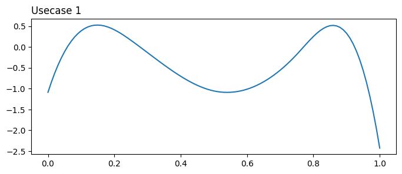
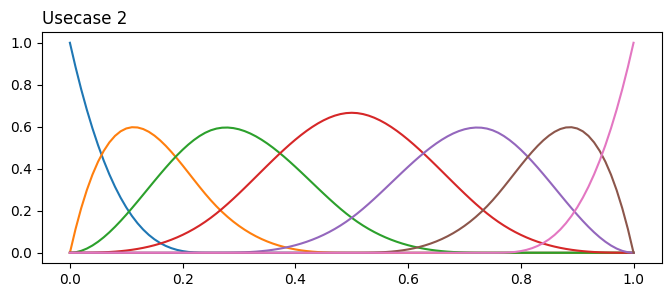
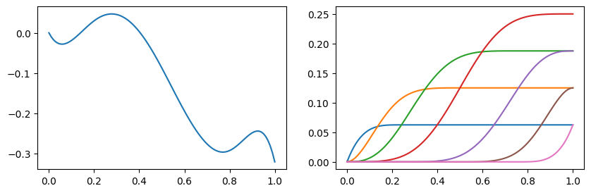

.. image:: https://img.shields.io/pypi/l/xspline
    :target: https://github.com/zhengp0/xspline/LICENSE

.. image:: https://img.shields.io/pypi/v/xspline
    :target: https://pypi.org/project/xspline

.. image:: https://img.shields.io/github/actions/workflow/status/zhengp0/xspline/python-build.yml?branch=main
    :target: https://github.com/zhengp0/xspline/actions

.. image:: https://img.shields.io/badge/docs-here-green
    :target: https://zhengp0.github.io/xspline

XSpline
=======

Advanced spline package that provides b-spline bases, their derivatives and integrals.

Installation
------------

XSpline can be install via

.. code-block:: bash

    pip install xspline>=0.1.0

Requirements
------------

XSpline requires python 3.10 or higher. XSpline only depends on ``numpy>=1.25.1``.

Usage
-----

You can use XSpline as a univariate function or use it to get design matrix.

.. code-block:: python
    
    import numpy as np
    import matplotlib.pyplot as plt
    from xspline import XSpline

    spline = XSpline(knots=[0, 0.25, 0.5, 0.75, 1], degree=3)
    x = np.arange(0, 1.01, 0.01)

One is to use XSpline as a univariate function. In this case, user must provide
coefficients for the spline bases.

.. code-block:: python

    np.random.seed(123)
    spline.coef = np.random.randn(len(spline))
    y, design_mat = spline(x), spline.get_design_mat(x)

    fig, ax = plt.subplots(1, 2, figsize=(10, 3))
    ax[0].plot(x, y)
    ax[1].plot(x, design_mat)

XSpline can be used to obtain derivatives.

.. code-block:: python

    dy, ddesign_mat = spline(x, order=1), spline.get_design_mat(x, order=1)

    fig, ax = plt.subplots(1, 2, figsize=(10, 3))
    ax[0].plot(x, dy)
    ax[1].plot(x, ddesign_mat)

XSpline can be used to obtain definite integrals.

.. code-block:: python

    iy, idesign_mat = spline(x, order=-1), spline.get_design_mat(x, order=-1)

    fig, ax = plt.subplots(1, 2, figsize=(10, 3))
    ax[0].plot(x, iy)
    ax[1].plot(x, idesign_mat)

XSpline can extrapolate with different polynomial options

.. code-block:: python

    np.random.seed(123)
    # constant extrapolation one the left and linear extrapolation on the right
    spline = XSpline(
        knots=[0, 0.25, 0.5, 0.75, 1],
        degree=3,
        ldegree=0,
        rdegree=1,
        coef=np.random.randn(len(spline)),
    )
    x = np.arange(-0.5, 1.51, 0.01)
    y, design_mat = spline(x), spline.get_design_mat(x)

    fig, ax = plt.subplots(1, 2, figsize=(10, 3))
    ax[0].plot(x, y)
    ax[1].plot(x, design_mat)
    for i in range(len(ax)):
        ax[i].vlines(
            [0, 1],
            ymin=0,
            ymax=1,
            transform=ax[i].get_xaxis_transform(),
            linestyle="--",
            linewidth=1,
            color="grey",
        )

.. image:: images/readme_usage_3.png
